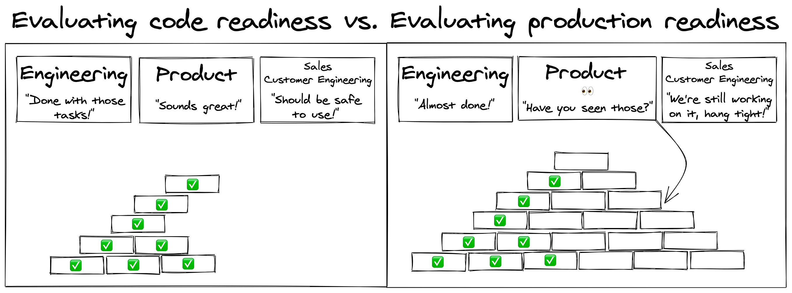
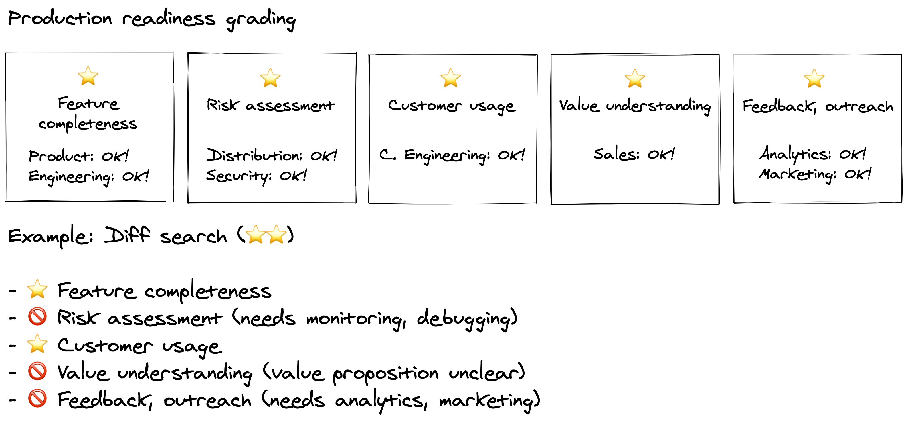
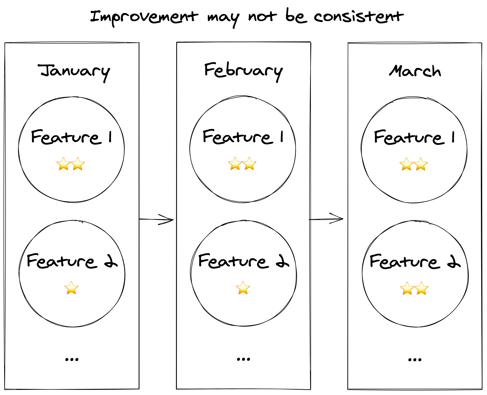

# Production readiness

## A great product goes beyond just planning and development

Making Sourcegraph a great piece of software and a great product entails many different aspects far beyond initial [product planning](../../product/planning.md) and [development](../../engineering/index.md).

## Production readiness depends on who you ask

Regardless of how much input each team has in planning and development, when a new feature is developed many questions are raised:

## Miscommunication creates unhappy users

Miscommunication between teams leads to chaos and creates unhappy users:

## Process stifles innovation and progress

Formalizing everything into a process and blocking engineers also isn't good:

## "Rome wasn’t built in a day, but they were laying bricks every hour." - John Heywood

.. and someone had a vision for how many more bricks were needed, and where.

## Production readiness grading

By using a production readiness grading system, we are able to _communicate_ how complete a feature is in our product - both internally and to users - allowing us to agree on the maturity of a feature:

## A unified understanding of _where we are_

The goal is to allow engineering to ship fast and iteratively, while still keeping track of what future improvements are needed by other teams at Sourcegraph in order for us to have the best product possible, giving us a unified understanding:

## Where we are, not what we're doing

We should improve over time - but a low grade doesn't mean the feature can't be shipped, it just means we don't think it is as high-quality as it could be.

## How and when are stars gained?

The teams associated with a given category will each have their own process for deciding when a feature is OK. This may be something that team, the feature author, or a combination of the two has to do.

## Tracking production readiness

Head on over to [tracking production readiness](tracking.md)!
